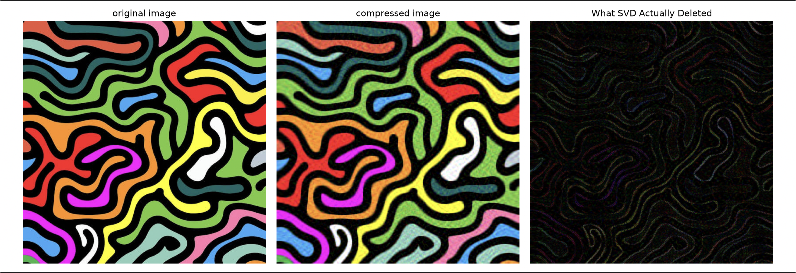
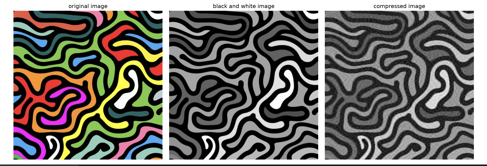
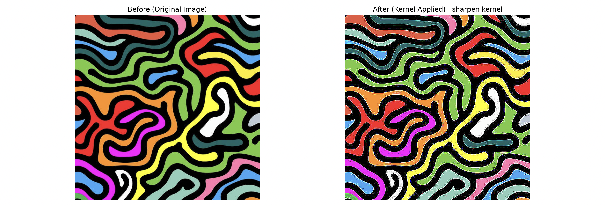
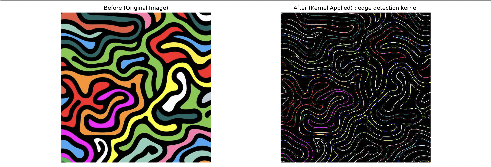
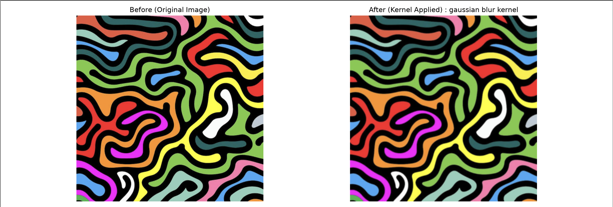

# PIXEL-MATRIX : Image Processing Toolki

PixelMatrix is a Python-based image processing toolkit that explores common image transformations through matrix operations, SVD, convolution, and numerical methods and using linear algebra

```text
Image
  ↓
Represent as matrix
  ↓
Mathematical operation
  ↓
Transformed matrix
  ↓
Image
```


## Features

- Image compression using SVD(Eckart–Young–Mirsky theorem)
- Black and white image conversion and compression
- Image sharpening
- Edge detection
- Image blurring


## Mathematics Behind the project(Backbone of the project)

any image can be represented as a 3D-array and the columns and
rows of the matrix will depend on the size of the image.
this array is a stack of 3 layers 
- top-layer(0 index) : red color
- middle-layer(1 index) : green color
- bottom-layer(2 index) : blue color
each value in the array is a number between 0 and 225 (0-255) the
higher the value higher the intensity of the specific layer(color)

while doing the image compression we will divide the array into 3 2D-arrays
(red,green and blue layers) and we will do operations seperatlry on layer 
and then we stack them up at the end.

### 1.SVD Image Compression

SVD states that any 2D matrix A can be written as linear combination of rank one matrices.
In mathematical form A = UΣVᵀ where,
- U,V are orthongonal matrices (U=mxm,V=nxn)
- Σ is a diagonal matrix with all positive enteries and these are the 
coefficients in the lineat combination(all the constans will be in non-increasing order)(Σ=mxn)
after applying the SVD Eckart–Young–Mirsky theorem comes into the picture

### Eckart–Young–Mirsky theorem

In this we take the first k constants in the Σ(diagonal matrix) to compress the size
The intution the smallest contstants hold very less data so if we delete those small
constants in according to our range the image will ge compressed without losing the
important original data
- Aₖ=UₖΣₖVₖᵀ
- Uₖ=mxk, Vₖ=kxn
- Σₖ=kxk

### 1.Image compression using SVD

we input the value of k after that with the help of k and the significant
values of the constat we keep the top most important constants(according to k) 
in the image we do this for each and every layer then we will stack them.

we get the compressed image and if we delete the orginal and the compressed 
image data we will get the image of what SVD actually deleted.
for example: for sample2 image,k=10


### 2.Black and white image conversion and compression

every balck and white image is 2D-array unlike color image it has only one stack

the value of the each element in 2D-array of black and white image is 
- bw_image = ((0.299 * R) + (0.587 * G) + (0.114 * B))/255.0 
every value is between 0 and 1 (0-1) that is the reason we are dividing by 225 
0 represents pure black and 1 represents white any thing between 0-1 is 
considered as a shade of gray

From where does those values come from?
the human eye perceives green light as much brighter than red or blue, and 
it is written like that to accurately match our biological vision while 
scaling the pixel numbers between 0.0 and 1.0 for computers.

after converting the color image into black and white we again apply the
 SVD and get the compressed image
for example: sample2 image,k=10


In image compression and bw image compression it will give the analysis on the 
orginal and compressed image.
but for large values of k the size of the compressed image will be greater than 
the orginal image the reason is mentioned in the note below

> **NOTE:** While entering the percentage value, if the value is greater than approximately **13%**, the compressed image size may be greater than the original image size. This is because the original image is stored as `uint8`, while the compressed image is stored as `float32`. Therefore, enter a percentage value between **1% and 13%** to get a compressed image size smaller than the original image size.

### usage of filter 2D

The 2D filter moves across the image and multiplies each
pixel in the selected region with the corresponding value
of the kernel. The multiplied values are then added to
obtain the new pixel value.

### 3.Image sharpening

sharpen kernel:
```math
 \begin{bmatrix} 
-1 & -1 & -1 \\ 
-1 & 9 & -1 \\ 
-1 & -1 & -1 
\end{bmatrix}
```

The values in the kernel determine how the surrounding
pixels affect the current pixel. The kernel gives more
importance to the center pixel and uses the surrounding
pixels to increase the difference between neighboring
pixels, making the image appear sharper.

for example: sample2 image


### Edge detection

edge_detection kernel:
```math
 \begin{bmatrix} 
-1 & -1 & -1 \\ 
-1 & 8 & -1 \\ 
-1 & -1 & -1 
\end{bmatrix}
```

The values in the kernel are designed to detect changes
in intensity between neighboring pixels. These changes
help identify boundaries and edges in the image.

for example: sample2 image


### Gaussian Blur

Gaussian_blur kernel:
```math
 \begin{bmatrix} 
1/9 & 1/9 & 1/9 \\ 
1/9 & 1/9 & 1/9 \\ 
1/9 & 1/9 & 1/9 
\end{bmatrix}
```

The values in the kernel determine how much importance
is given to the surrounding pixels. The kernel is designed
to average the neighboring pixel values, which smooths
the image and produces the blur effect.

for example: sample2 image

 
## Project Structure

```text
imagecompression/
│
├── project_screenshots/
│   ├── 1comp.png
│   ├── 2bw_comp.png
│   ├── 3sharp.png
│   ├── 4edge.png
│   └── 5blur.png
│
├── sample_images/
│   ├── sample1.jpg
│   └── sample2.jpg
│
├── blur.py
├── bw_comp.py
├── edge.py
├── image_compression.py
├── main.py
├── README.md
├── requirements.txt
├── sharpen.py
└── .gitignore
